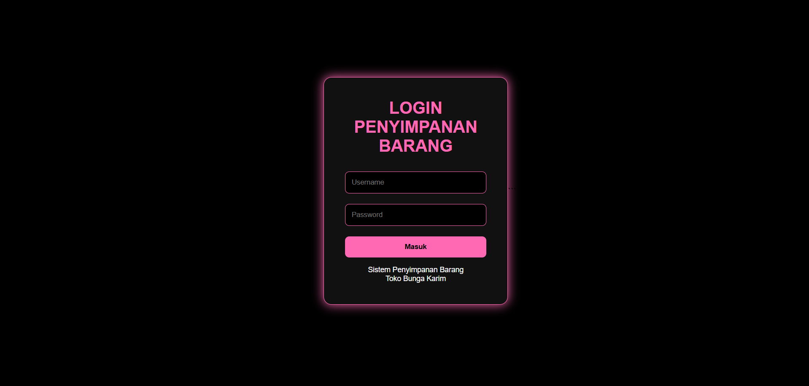
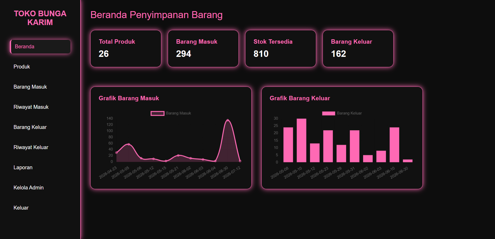
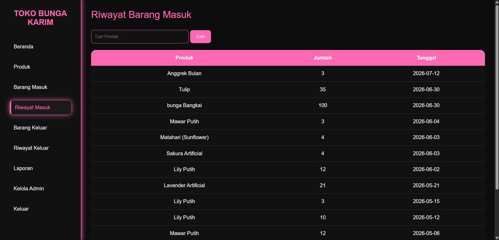
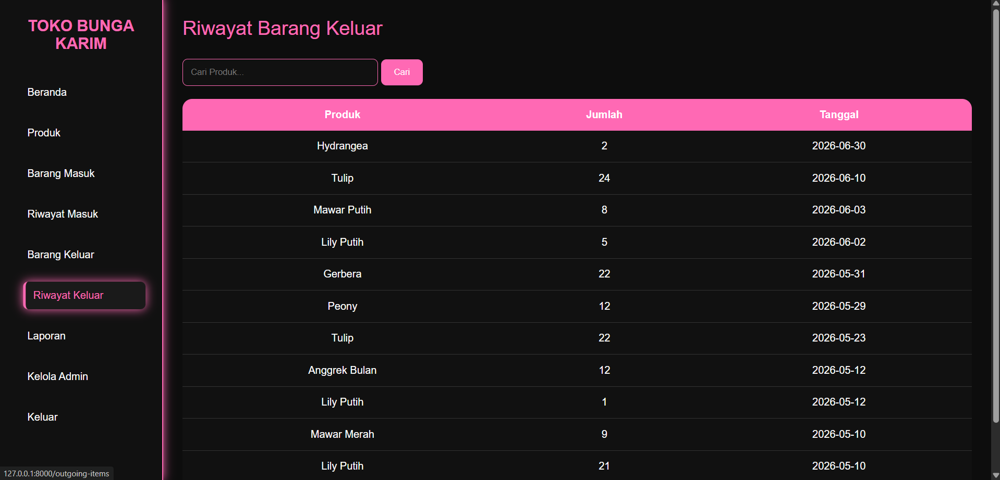
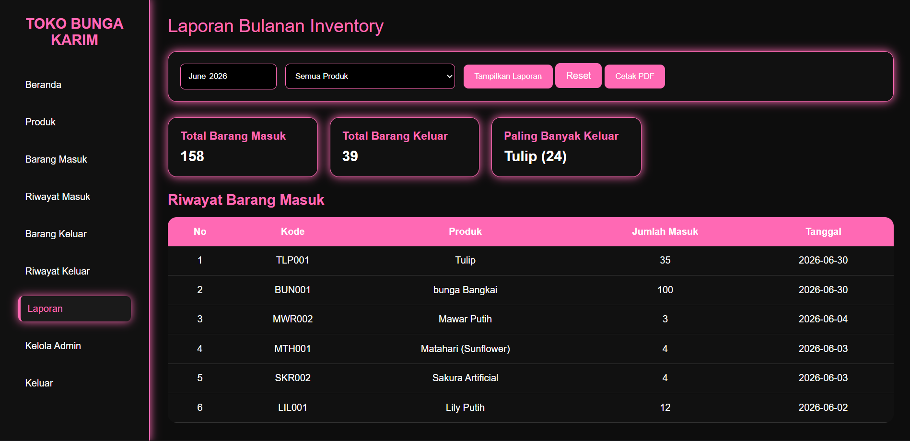

# Karim Florist — Inventory Management System

> Sistem Informasi Inventory Barang Berbasis Web untuk membantu pengelolaan stok barang pada Toko Bunga Karim Florist.



## Tentang Project

**Karim Florist Inventory Management System** merupakan aplikasi berbasis web yang dirancang untuk membantu proses pengelolaan persediaan barang pada Toko Bunga Karim Florist.

Aplikasi ini dibuat untuk mempermudah pengelolaan data produk, pencatatan barang masuk dan keluar, serta pemantauan kondisi persediaan secara lebih terstruktur.

Project ini dikembangkan sebagai bagian dari implementasi dan pengembangan kemampuan dalam bidang **Web Development, Database Management, dan Software Engineering**.

---

## Fitur Utama

- **Authentication & Login**
- **Dashboard**
- **Manajemen Data Produk**
- **Pencatatan Barang Masuk**
- **Pencatatan Barang Keluar**
- **Monitoring Stok Barang**
- **Laporan Inventory**
- **Manajemen Admin**

---

## Preview

### Dashboard



### Data Produk


### Barang Masuk



### Barang Keluar



### Reports



---

## Teknologi yang Digunakan

| Teknologi | Keterangan |
|---|---|
| PHP | Backend |
| Laravel 10 | Web Framework |
| MySQL | Database |
| Blade | Template Engine |
| Bootstrap | User Interface |
| JavaScript | Frontend Interaction |
| Chart.js | Data Visualization |
| Laragon | Local Development Environment |

---

## Database

Database yang digunakan dalam project ini adalah **MySQL**.

Beberapa data yang dikelola meliputi:

- Admin
- Produk
- Barang Masuk
- Barang Keluar
- Stok Barang

---

## Cara Menjalankan Project

### 1. Clone repository
```bash
git clone https://github.com/USERNAME/TokoBunga.git
```

### 2. Masuk ke folder project
```bash
cd TokoBunga
```

### 3. Install dependency
```bash
composer install
```

### 4. Buat file .env
Salin file .env.example menjadi .env:
```bash
cp .env.example .env
```

### 5. Generate application key
```bash
php artisan key:generate
```

### 6. Konfigurasi database
```bash
DB_DATABASE=tokobunga
DB_USERNAME=superadmin
DB_PASSWORD=super123
```

### 7. Jalankan migration
```bash
php artisan migrate
```

### 8. Jalankan aplikasi
```bash
php artisan serve
```

### then open http://127.0.0.1:8000

